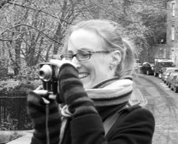

---
# You don't need to edit this file, it's empty on purpose.
# Edit theme's home layout instead if you wanna make some changes
# See: https://jekyllrb.com/docs/themes/#overriding-theme-defaults
layout: home
permalink: /
title: Home
order: 1
---

Marieke Schouwstra

ILLC

University of Amsterdam

## PhD position (fully paid)

Interested in linguistics and cognitive science? Keen to combine experiments and distributed semantic modeling? Looking for a PhD position? Check out [this project](https://vacatures.uva.nl/UvA/job/PhD-Position-in-Modelling-Word-Order-and-Cognitive-Constraints/794873002/) I'll be supervising together with [Jelke Bloem](https://www.uva.nl/profiel/b/l/j.bloem/j.bloem.html). Deadline is 31st May 2024; starting date ~September. 

I am Assistant Professor in cognitive science and artificial intelligence at the Institute for Logic, Language and Computation. 

My research focuses on how individual and cultural processes interact to give us structured languages that allow us to share our thoughts. I study this by observing what happens when languages are created anew, in laboratory experiments in which participants communicate in novel ways, and I combine this experimental approach with computational models and data from existing languages. 
I teach in the interdisciplinary program Cognition, Language and Communication, as well as in Linguistics and Logic. 

## Origins of complex meaning

Humans use complex expressions to convey complex meanings, a trait that is unique to our species. I am interested in how complex meaning is best characterised, and how it came about. 

## Starting froms scratch: improvisation 

One of the methodologies I use are laboratory experiments in which adult participants improvise to convey information. For example, in **silent gesture** experiments, participants describe events using only their hands and no speech. See this paper in [Cognition](http://www.sciencedirect.com/science/article/pii/S0010027714000432) and this one in [Frontiers of Psychology](https://www.frontiersin.org/articles/10.3389/fpsyg.2022.805144/abstract). [This paper in Cognitive Science](https://onlinelibrary.wiley.com/doi/full/10.1111/cogs.12732?casa_token=vD9l93ny4d0AAAAA%3A_Pi5_tQ1ZWxppY2eBsZGUt3-Q4Am9XQrDPgYmO-RIOGxiIqXBYLeQT7CnMKA3N3mka83ZWulGDrTIA) combines silent gesture with a computational model, focusing on fundamental differences between interpretation and production in emerging language systems.  

## Evolving a communication system in the lab

I am interested in how the preferences that surface in *improvisation* change under the influence of cultural evolutionary mechanisms, like *communicative interaction* and *iterated learning*. See [this paper under review](https://psyarxiv.com/7ed89/) and [this paper in Cognition](https://www.sciencedirect.com/science/article/pii/S0010027719301234) (with [Dr Yasamin Motamedi](https://ymotamedi.github.io/)).

## Comparing lab studies with data from real languages

How do the lingusitic structures that people improvise in the lab compare to the structures we see in the languages around us? See this paper in [Cognitive Science](http://onlinelibrary.wiley.com/doi/10.1111/cogs.12441/full), in which silent gesture is compared to early stages of L2 acquisition, and [this paper](https://www.researchgate.net/profile/Susan-Goldin-Meadow/publication/324480785_Do_we_see_word_order_patterns_from_silent_gesture_studies_in_a_new_natural_language/links/5ad6087d458515c60f552cbe/Do-we-see-word-order-patterns-from-silent-gesture-studies-in-a-new-natural-language.pdf)  in which we compare silent gesture lab results to word order variation in Nicaraguan Sign Language.

## We grow languages 

See [www.wegrowlanguages.com](http://wegrowlanguages.com) for news and background on our recently completed [ESRC grant](https://gtr.ukri.org/person/644282F1-3016-4A1F-A191-2EDB3870C391).

