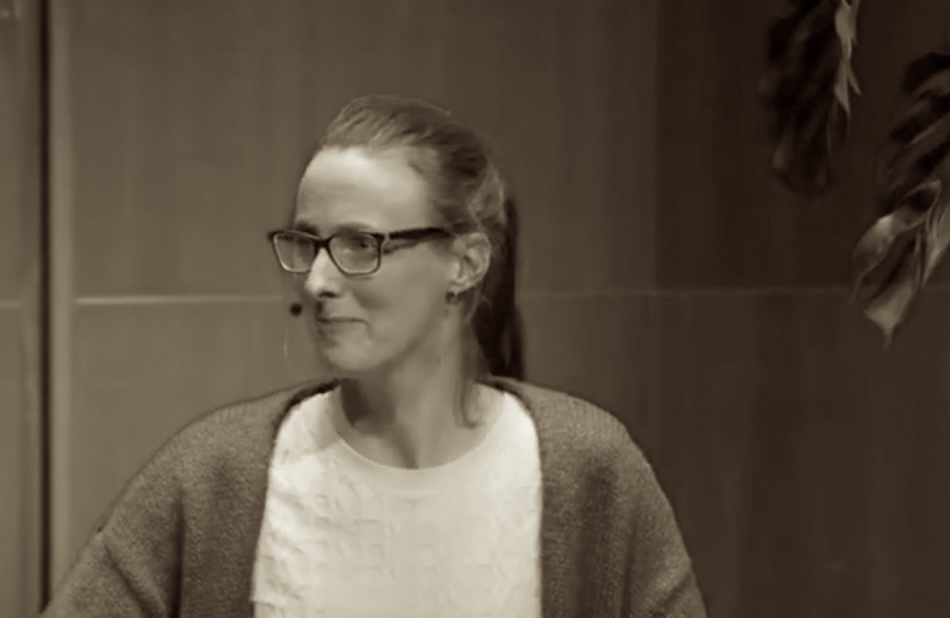

---
# You don't need to edit this file, it's empty on purpose.
# Edit theme's home layout instead if you wanna make some changes
# See: https://jekyllrb.com/docs/themes/#overriding-theme-defaults
layout: home
permalink: /
title: Home
order: 1
---

## Marieke Schouwstra, 
Associate professor at ILLC, University of Amsterdam

**Language is everywhere**. We use it every day to describe what is on our minds. We are, in a sense, all language experts. At the same time, important questions about how language works, and why, have remained unanswered.

**Language is flexible and resilient**. People can use language in spoken, written, or signed forms. When there is a group of people together but no language that they share, they will create one. 

Taking an evolutionary perspective can help us better understand human language. Using rich data from different sources and different modalities, I study where language rules come from:

- **Silent gesture experiments** simulate the emergence of new linguistic systems in the lab.
- **Analysis of language data** shows us the rich variety of ways in which people convey information. 
- **Computational simulations** help explore the dynamics between individual language users and the group they belong to.

<figure>
</img>
<figcaption>Photo by Studium Generale Utrecht</figcaption>
</figure>

I teach courses in the Cognition Language and Communication program, as well as the Psychobiology course Evolution of Language and Music. And I supervise student projects in many different programmes. Interested? Get in touch (see email address below)! Not sure yet? Read more about my research. 

## Language Evolution and Learning

With Fausto Carcassi, Raquel Alhama, and Katrin Schulz, I run the Language Evolution and Learning talk series. [Check our schedule or sign up for our email list here!](https://sites.google.com/view/lela-amsterdam)

